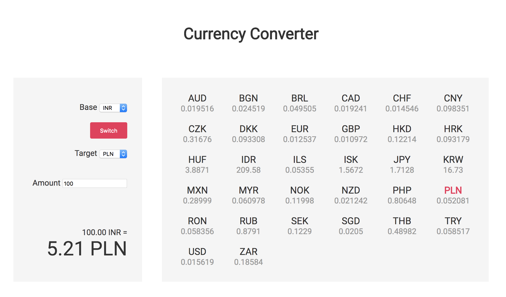

# SamKnows Front-End Technical Test

Thank you for your application. Here's a short technical test before we invite
you in for interview.

The test is divided into two parts: the first part is to create a small app,
and the second part is to improve some existing code. The first part should
take an hour to an hour and a half, and the second part shouldn't take long at all.

If you don't complete the test, don't worry about it - just send the test back
with as much as you've done. Also, it would be nice if you could say what you
would change if you had more time.

## Part one: a currency conversion app

> This should take you an hour to an hour and a half.

The task is to create a currency conversion app that looks something like this:



We'd like you to use Vue or React to do this.

Try to stick as close to the design as possible and it is preferred that you write
your own CSS. If you'd like to improve on the design, please go ahead but no
worries if you can't — this is the front-end test, not the design test!

You can select a base currency and a target currency to convert a specific
amount between currencies, and a list of currencies will be displayed on the
right side of the display containing the current prices of various currencies
against the selected base currency.

You can swap the base and target currencies and the affected values will
update automatically

For getting the conversion rates, use this API: http://api.fixer.io/latest?base=GBP

Display currencies using the browser locale.

We're looking for:

- Functionality: it should work, obviously!
- Design: it looks like (or better than) the design above.
- Code quality: code should be readable and maintainable.

## Part two: refactoring

> This shouldn't take long.

There's a file in this directory called `flatten.js`. It contains a function to
flatten an array or an object (discarding the keys).

```js
flatten([1, 2, [3, [[4], 5]], 6]); // [1, 2, 3, 4, 5, 6]
flatten({ hello: 1, world: [2, 3, { foo: [[4]]}] }); // [1, 2, 3, 4]
flatten([2, 'test']); // [2, 'test']
```

Non-object values like strings and numbers should just be passed through.

It's an okay function, but it could be a lot cleaner, and a lot shorter: this
function is written using only ES3, and because we don't support old versions
of Internet Explorer and we use Babel, you can use ES5 and ES2016.

We're looking for:

- It should work. Other than that, there isn't really a wrong answer. Just curious
to see what you'll do.

Good luck!
