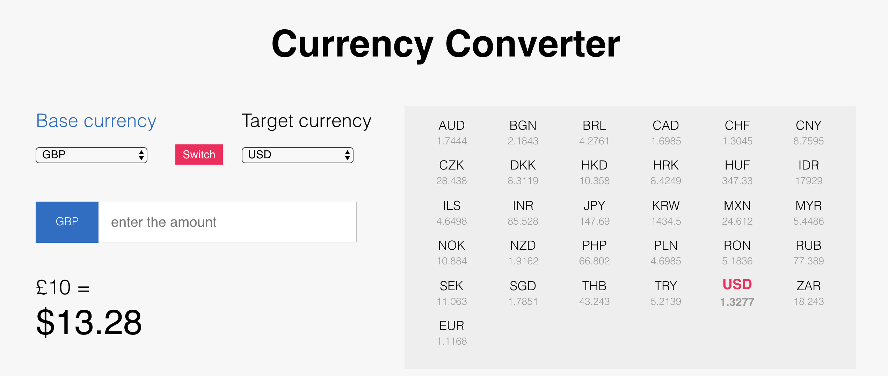

# SamKnows Front-End Technical Test

Thank you for your application! Here's a short technical test before we invite
you in for interview.

The test is divided into two parts: the first part is to create a small app,
and the second part is to improve some existing code. The first part should
take 45 minutes to an hour, and the second part shouldn't take long at all.

If you don't complete the test, don't worry about it - just send the test back
with as much as you've done. Also, it would be nice if you could say what you
would change if you had more time.

## Part one: a currency conversion app

> This should take you about an hour.

The task is to create a currency conversion app following roughly this design:



You can enter a base currency and a target currency to convert a specific
amount between currencies, and a list of currencies will be displayed on the
right side of the display containing the current prices of various currencies
against the selected base currency.

We'd like you to use a framework to achieve this. We'd prefer Vue.js, but if
you're not familiar with that, you're welcome to use something else as long as
it is a modern and popular framework (i.e. react, angular2, ...).
 
For the currencies, use this API: http://api.fixer.io/latest?base=GBP

Display currencies using the browser locale.

Good luck!

## Part two: refactoring

> This shouldn't take long.

There's a file in this directory called `flatten.js`. It contains a function to
flatten an array or an object (discarding the keys).

```js
flatten([1, 2, [3, [[4], 5]], 6]); // [1, 2, 3, 4, 5, 6]

flatten({ hello: 1, world: [2, 3, { foo: [[4]]}] }); // [1, 2, 3, 4]
```

Non-object values like strings and numbers should just be passed through.

It's an okay function, but it could be a lot cleaner, and a lot shorter: this
function is written using only ES3, and because we don't support old versions 
of Internet Explorer and we use Babel, we can use ES5 and ES2016.

The task is to improve the function. This is entirely subjective and there's
basically nothing you can do wrong - just curious!
